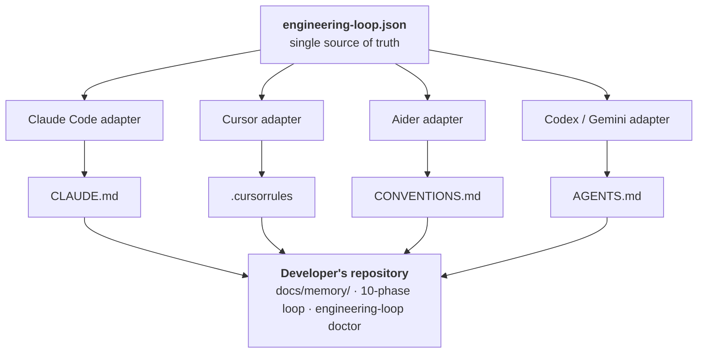
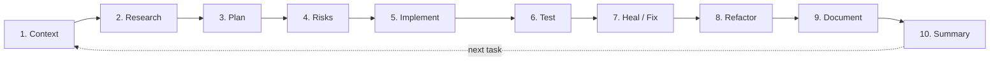

# Engineering Loop Standard

[](https://www.npmjs.com/package/engineering-loop)
[](LICENSE)

**An open, agent-agnostic specification for disciplined, AI-assisted software
engineering.**

AI coding tools change every few months. The methodology that makes them
produce trustworthy code does not. The Engineering Loop Standard (ELS) is a
small, versioned specification — `engineering-loop.json` plus a `docs/memory/`
convention — that any coding agent (Claude Code, Cursor, Aider, Codex,
Gemini, or whatever ships next) can read and follow. Write the spec once,
generate an adapter for every tool.

Prior art exists for pieces of this problem — repository-level rule files,
loop-based agent runners, agent-loop tutorials. None of them combine a formal,
provider-independent configuration schema, a persistent project-memory
convention, and generated adapters for multiple tools in one versioned
standard. That gap is what this repository fills.

---

### Contents

- [Why a standard instead of another prompt file](#why-a-standard-instead-of-another-prompt-file)
- [Architecture](#architecture)
- [The manifesto](#the-manifesto)
- [The 10-phase loop](#the-10-phase-loop)
- [Quick start](#quick-start)
- [The configuration file](#the-configuration-file)
- [Repository layout](#repository-layout)
- [Versioning](#versioning)
- [Contributing](#contributing)

## Why a standard instead of another prompt file

| | Traditional prompt files | Engineering Loop Standard |
|---|---|---|
| Portability | Coupled to one model/interface | Agnostic — Claude, Cursor, Codex, Gemini, ... |
| Governance | Ad hoc, informal | Specified (`engineering-loop.json`, versioned) |
| Longevity | Breaks when the tool changes | Survives new agent generations |
| Adoption | Copy-paste text by hand | `npx engineering-loop init` |
| Memory | Lives in chat history | Persistent, structured `docs/memory/` |

## Architecture

One config, one memory convention, one manifesto — many adapters. Every
adapter is a pure function of `engineering-loop.json`: same config in, same
generated file out, no hidden state.



See [docs/ADAPTERS.md](docs/ADAPTERS.md) for how an adapter is generated and
how to add support for a new tool.

## The manifesto

The full text lives in [MANIFESTO.md](MANIFESTO.md). Six principles govern
every adapter this project generates:

1. Understand before acting.
2. Research before building.
3. Plan before execution.
4. Verify before completing.
5. Document as you go.
6. Leave the codebase better than you found it.

## The 10-phase loop

Every task — feature, bugfix, refactor, or infra change — moves through the
same loop, defined in full (with per-phase exit conditions) in
[docs/SPECIFICATION.md](docs/SPECIFICATION.md):



An agent may collapse phases for trivial changes, but must not skip Phase 6
(Test) or Phase 9 (Document) for anything that touches tracked source
files (§3 of the specification).

## Quick start

```bash
npx engineering-loop init
```

```
✔ Created engineering-loop.json
✔ Initialized docs/memory/ (PROJECT.md, ARCHITECTURE.md, ROADMAP.md, TASKS.md, DECISIONS.md, KNOWLEDGE.md)
✔ Generated adapter: Claude Code (CLAUDE.md)
✔ Generated adapter: Cursor (.cursorrules)
✔ Generated adapter: Aider (CONVENTIONS.md)
✔ Generated adapter: Codex / Gemini (AGENTS.md)
Engineering Loop ready.
```

Only need specific adapters?

```bash
npx engineering-loop init --adapters claude,cursor
```

Check that an existing project still conforms to the spec:

```bash
npx engineering-loop doctor
```

Want to see it applied to a real, working project instead of a bare
scaffold? See [examples/todo-api](examples/todo-api).

## The configuration file

`engineering-loop.json` is the single source of truth every adapter is
generated from. Full schema at
[engineering-loop.schema.json](engineering-loop.schema.json).

```json
{
  "$schema": "https://raw.githubusercontent.com/sergiorebolledo/engineering-loop-standard/v1.0.0/engineering-loop.schema.json",
  "version": "1.0.0",
  "project": {
    "name": "my-app",
    "architecture_style": "modular-monolith"
  },
  "memory": {
    "directory": "docs/memory",
    "required_files": [
      "PROJECT.md",
      "ARCHITECTURE.md",
      "ROADMAP.md",
      "TASKS.md",
      "DECISIONS.md",
      "KNOWLEDGE.md"
    ]
  },
  "pipeline": {
    "pre_code": ["research", "plan"],
    "post_code": ["lint", "test", "refactor", "update_docs"]
  },
  "commands": {
    "test": "npm test",
    "lint": "npm run lint",
    "build": "npm run build"
  },
  "language_policy": {
    "code": "en",
    "comments": "en",
    "docs": "en",
    "commits": "en"
  },
  "agents": {
    "allow_auto_fix": true,
    "max_repair_iterations": 3
  }
}
```

## Repository layout

```text
.
├── engineering-loop.json          # This repo's own config (dogfooded)
├── engineering-loop.schema.json   # Formal JSON Schema for the config
├── MANIFESTO.md                   # Standalone Agentic Engineering Manifesto
├── CONTRIBUTING.md, CODE_OF_CONDUCT.md, SECURITY.md
├── docs/
│   ├── SPECIFICATION.md           # Full standard, versioned
│   ├── ADAPTERS.md                # How adapters work, how to add one
│   └── memory/
│       ├── PROJECT.md
│       ├── ARCHITECTURE.md
│       ├── ROADMAP.md
│       ├── TASKS.md
│       ├── DECISIONS.md
│       └── KNOWLEDGE.md
├── packages/
│   └── cli/                       # `engineering-loop` npm package
└── examples/
    └── todo-api/                  # Worked example: a real ELS-compliant project
```

## Versioning

The standard follows semver independently of the CLI package. Breaking
changes to `engineering-loop.schema.json` bump the major version and are
recorded in [CHANGELOG.md](CHANGELOG.md) and
[docs/memory/DECISIONS.md](docs/memory/DECISIONS.md).

## Contributing

See [CONTRIBUTING.md](CONTRIBUTING.md) for dev setup, how to propose a
change to the specification, and commit/PR conventions. New agent adapters
are especially welcome — see [docs/ADAPTERS.md](docs/ADAPTERS.md) for the
interface a `packages/cli/src/adapters/*` module must implement. This
project follows a [Code of Conduct](CODE_OF_CONDUCT.md); report
vulnerabilities per [SECURITY.md](SECURITY.md).

## License

[MIT](LICENSE)
